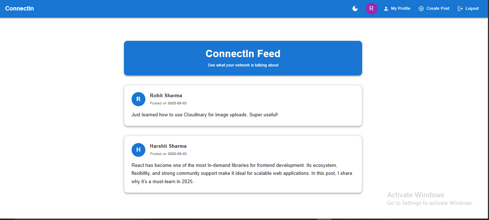
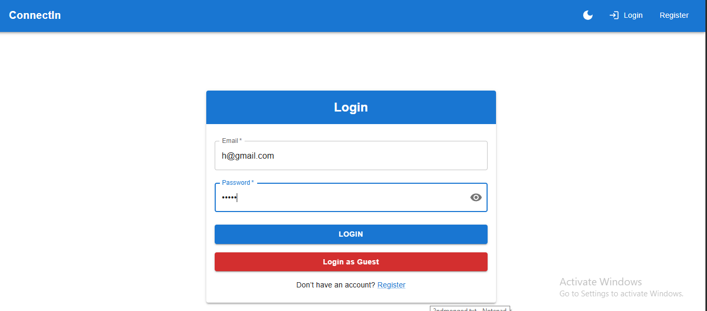
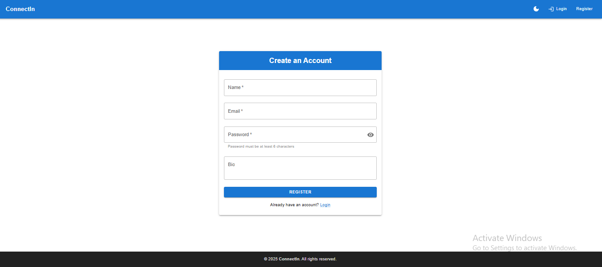
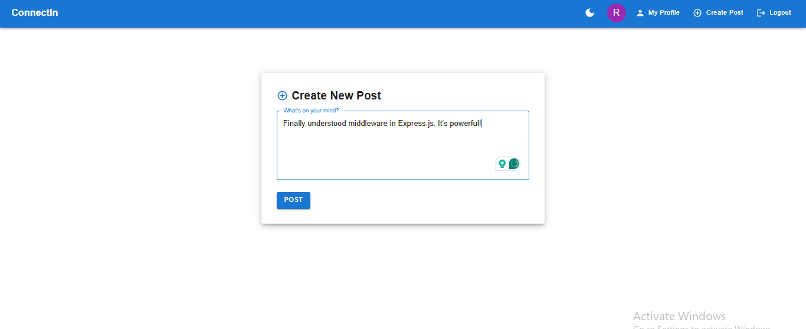
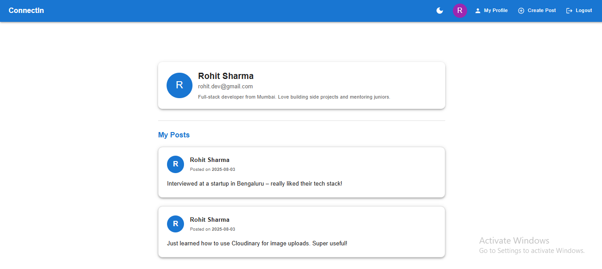
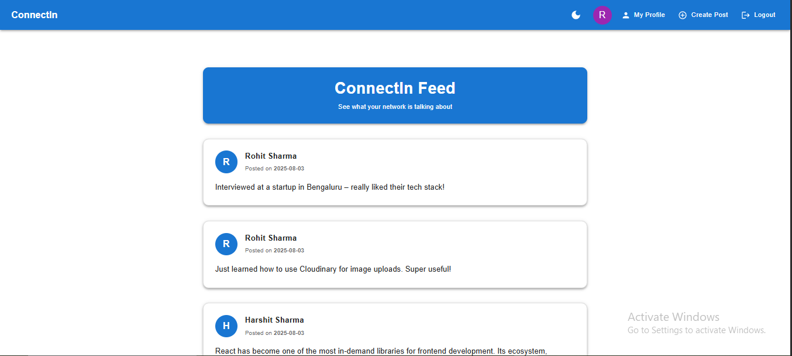
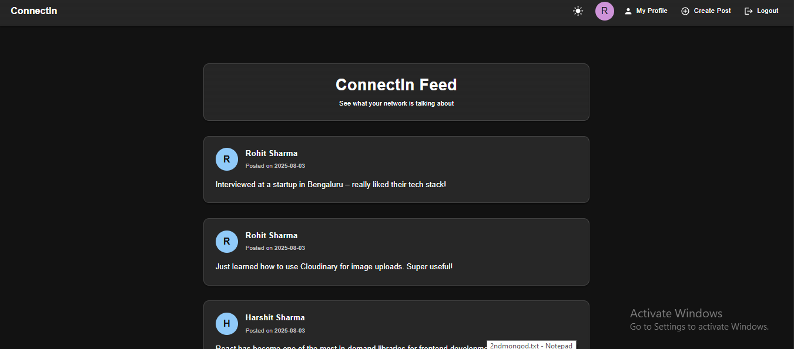

# 👔 LinkedIn Clone

A full-stack LinkedIn-inspired social networking app built with **React**, **MUI**, **Express**, and **MongoDB**. Features user authentication, post sharing, user profiles, dark mode, and responsive design.

---

## 🔗 Live Demo

- 🚀 **Vercel**: [Frontend on Vercel](https://linkedin-clone-pink-nine.vercel.app)
- 🌐 **Render**: [Live App on Render](https://linkedin-clone-f8ab.onrender.com)
- 💻 **GitHub**: [GitHub Repo](https://github.com/sharmaHarshit2000/linkedin-clone)

---

## 📁 Project Structure

```
LinkedIn-clone/
├── backend/
│   ├── config/
│   │   └── db.js
│   ├── controllers/
│   │   ├── authController.js
│   │   ├── postController.js
│   │   └── userController.js
│   ├── middlewares/
│   │   ├── authMiddleware.js
│   │   └── errorMiddleware.js
│   ├── models/
│   │   ├── Post.js
│   │   └── User.js
│   ├── node_modules/
│   ├── routes/
│   │   ├── authRoutes.js
│   │   ├── postRoutes.js
│   │   └── userRoutes.js
│   ├── .env
│   ├── package-lock.json
│   ├── package.json
│   └── server.js
└── frontend/
    ├── node_modules/
    ├── public/
    │   └── vite.svg
    ├── src/
    │   ├── api/
    │   │   ├── auth.js
    │   │   ├── index.js
    │   │   ├── post.js
    │   │   └── user.js
    │   ├── assets/
    │   │   └── react.svg
    │   ├── components/
    │   │   ├── Footer.jsx
    │   │   ├── Header.jsx
    │   │   ├── Loader.jsx
    │   │   ├── PostCard.jsx
    │   │   └── ProtectedRoute.jsx
    │   ├── context/
    │   │   └── AuthContext.jsx
    │   ├── pages/
    │   │   ├── CreatePost.jsx
    │   │   ├── Home.jsx
    │   │   ├── Login.jsx
    │   │   ├── MyProfile.jsx
    │   │   ├── NotFound.jsx
    │   │   ├── Register.jsx
    │   │   └── UserProfile.jsx
    │   ├── App.css
    │   ├── App.jsx
    │   ├── index.css
    │   ├── main.jsx
    │   └── theme.js
    ├── .env
    ├── .gitignore
    ├── eslint.config.js
    ├── index.html
    ├── package-lock.json
    ├── package.json
    ├── README.md
    └── vite.config.js
```

---

## 🛠️ Tech Stack

### Frontend:
- React 19
- React Router DOM 7
- MUI (Material UI)
- Axios
- Notistack + React Hot Toast

### Backend:
- Node.js (ESM)
- Express 5
- MongoDB + Mongoose
- JWT (Authentication)
- Bcrypt (Password hashing)

---

## 📸 Screenshots

### 🏠 Home Page  


### 🔐 Login / Register  



### 📝 Create Post  


### 👤 Profile Page  


#### 🌞 Light Mode  


#### 🌙 Dark Mode  

---

## ⚙️ Environment Variables

### Backend: `backend/.env`
```env
PORT=5000
MONGODB_URI=mongodb://localhost:27017/linkedin_clone
JWT_SECRET=your_secret_key_here
```

### Frontend: `frontend/.env`
```env
VITE_API_BASE_URL=http://localhost:5000/api
```

---

## 🚀 Getting Started

### 1. Clone the repository:
```bash
git clone https://github.com/your-username/linkedin-clone.git
cd linkedin-clone
```

### 2. Setup Backend
```bash
cd backend
npm install
npm run dev
```
Make sure MongoDB is running or update `MONGODB_URI`.

### 3. Setup Frontend
```bash
cd frontend
npm install
npm run dev
```

---

## 📦 Scripts

### Frontend

| Command        | Description                  |
|----------------|------------------------------|
| `npm run dev`  | Start Vite dev server        |
| `npm run build`| Build for production         |

### Backend

| Command        | Description                  |
|----------------|------------------------------|
| `npm run dev`  | Start server with nodemon    |
| `npm start`    | Start server without watcher |

---

## 👤 Author

**Harshit Sharma**  
💼 [LinkedIn](https://www.linkedin.com/in/harshit-sharma-b93192199/)  
📧 harshitsharma9989@gmail.com

---